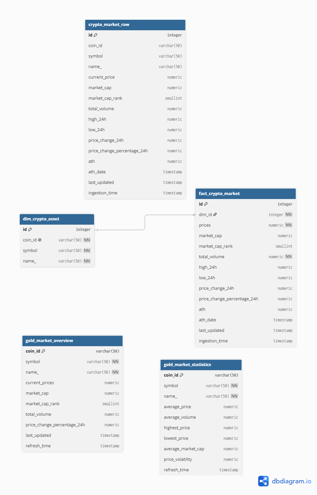
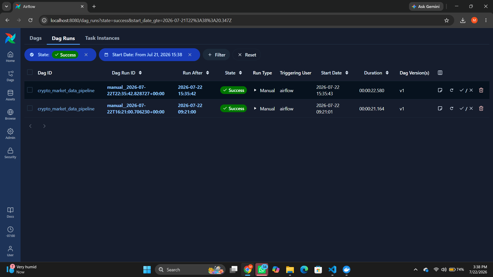
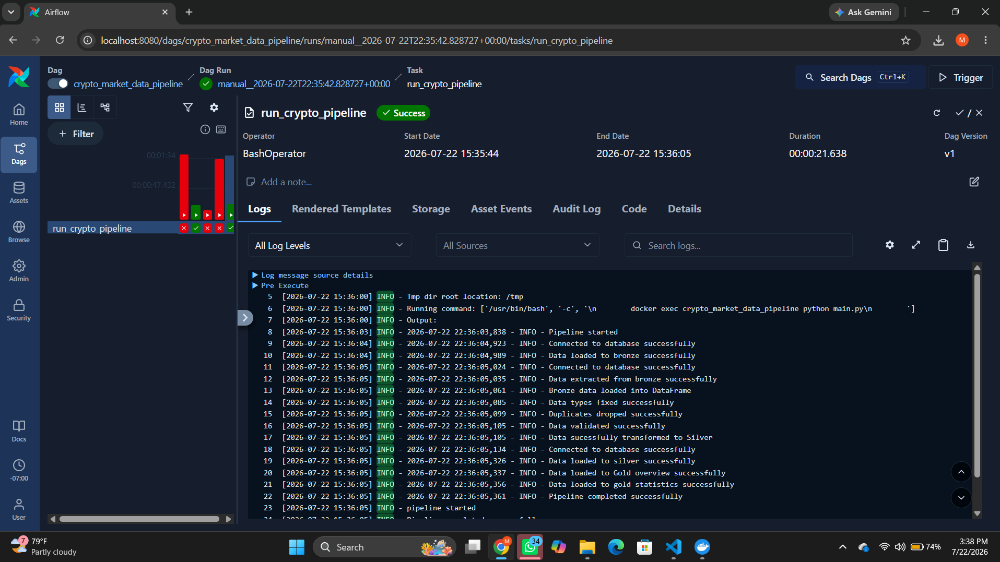

# Crypto Market Data Pipeline

A batch ETL pipeline that ingests cryptocurrency market data from the CoinGecko API, processes it through a Bronze → Silver → Gold medallion architecture, and lands it in PostgreSQL as a queryable star schema. Orchestrated with Apache Airflow, containerized end-to-end with Docker.

The design goal was reproducibility: every table downstream of the API call can be rebuilt from stored raw data, without hitting CoinGecko again.

**Stack:** Python · Apache Airflow · PostgreSQL · Docker · pandas · psycopg2

---

## Table of Contents

- [Architecture](#architecture)
- [Database Schema](#database-schema)
- [Project Structure](#project-structure)
- [Pipeline Workflow](#pipeline-workflow)
- [Medallion Architecture](#medallion-architecture)
- [Data Quality Checks](#data-quality-checks)
- [Engineering Decisions](#engineering-decisions)
- [Apache Airflow](#apache-airflow)
- [Pipeline Execution](#pipeline-execution)
- [Getting Started](#getting-started)
- [Future Improvements](#future-improvements)
- [Author](#author)

---

## Architecture

```text
                    Apache Airflow
                          │
                          ▼
                    python main.py
                          │
                          ▼
                  CoinGecko API
                          │
                          ▼
        ┌─────────────────────────────────┐
        │ Bronze Layer                    │
        │ crypto_market_raw               │
        └─────────────────────────────────┘
                          │
                extract_bronze_data()
                          │
                          ▼
               Data Transformation
      (type fixing, duplicate removal,
           range validation)
                          │
          ┌───────────────┴───────────────┐
          ▼                               ▼
┌──────────────────────┐      ┌──────────────────────┐
│ dim_crypto_asset     │◄────►│ fact_crypto_market   │
│ (Dimension Table)    │      │ (Fact Table)         │
└──────────────────────┘      └──────────────────────┘
          │                               │
          └───────────────┬───────────────┘
                          ▼
          ┌───────────────┴───────────────┐
          ▼                               ▼
┌────────────────────────┐     ┌────────────────────────┐
│ gold_market_overview   │     │ gold_market_statistics │
│ Dashboard-ready data   │     │ Aggregated metrics     │
└────────────────────────┘     └────────────────────────┘
```

---

## Database Schema



---

## Project Structure

```text
crypto_market-data-pipeline/
│
├── dags/
├── images/
├── logs/
├── sql/
├── api.py
├── database.py
├── transform.py
├── logger.py
├── main.py
├── Dockerfile
├── docker-compose.yml
├── docker-compose-airflow.yaml
├── requirements.txt
├── .env.example
├── .gitignore
└── README.md
```

---

## Pipeline Workflow

1. Extract live market data from the CoinGecko API.
2. Persist the raw response to the **Bronze** layer, unmodified.
3. Read from Bronze — never from the API — as the source for transformation.
4. Cast fields to their correct types.
5. Drop duplicate records.
6. Validate numeric ranges (price, market cap, volume).
7. Load conformed records into the Silver star schema.
8. Aggregate into Gold-layer reporting tables.
9. Commit the transaction.

---

## Medallion Architecture

### Bronze — raw, immutable

`crypto_market_raw` stores the CoinGecko API response as-is. No parsing, no casting, no filtering. This is the pipeline's replay source — if a downstream step fails or a business rule changes, Bronze can be reprocessed without re-calling the API.

### Silver — conformed, modeled

Bronze records are cleaned and shaped into a star schema:

- `dim_crypto_asset` — asset-level attributes
- `fact_crypto_market` — market metrics at time of extraction

Transformations are type casting, deduplication, and range validation — implemented as separate, composable functions rather than one monolithic step.

### Gold — aggregated, consumption-ready

- `gold_market_overview`
- `gold_market_statistics`

Pre-aggregated for downstream reporting/dashboarding, so consumers aren't re-deriving the same rollups from the fact table on every query.

---

## Data Quality Checks

Validation happens at the Bronze → Silver boundary, not after the fact:

- **Type enforcement** — numeric fields (price, market cap, volume) are cast explicitly; anything that fails to cast is treated as bad data, not coerced.
- **Deduplication** — duplicate records from the API response are dropped before they reach the fact table.
- **Range validation** — records with invalid values (e.g. negative price) are **dropped, not imputed**. A missing row is easier to reason about downstream than a silently fabricated one.

This is enforced in code (`transform.py`), not just assumed at query time.

---

## Engineering Decisions

**Bronze gets its own transaction**
Bronze writes commit independently of Silver/Gold. If the transform stage throws, the raw extract is already durable — reprocessing means re-reading Bronze, not re-hitting a rate-limited third-party API.

**Silver and Gold share a transaction**
These stages are tightly coupled: a fact row and its aggregates should never be half-committed. If either fails, both roll back, so Gold tables never reflect a Silver state that doesn't actually exist.

**No direct API reads past Bronze**
Every transformation downstream of ingestion reads from the Bronze table. This makes the pipeline replayable and keeps the CoinGecko API as a boundary, not a dependency scattered across the codebase.

---

## Apache Airflow

The DAG orchestrates `main.py` end-to-end, enabling scheduled or manually triggered runs through the Airflow UI rather than a cron job with no observability.



---

## Pipeline Execution

A completed run — API extraction, Bronze load, Silver transformation, Gold aggregation, commit.



---

## Getting Started

### Clone the Repository

```bash
git clone https://github.com/David-Ose-Mike/crypto_market-data-pipeline.git
cd crypto_market-data-pipeline
```

### Configure Environment Variables

Copy `.env.example` to `.env` and fill in your own values. `.env` is gitignored — it should never be committed.

### Build and Run

```bash
docker compose up --build
```

### Run with Airflow

```bash
docker compose -p airflow -f docker-compose-airflow.yaml up airflow-init

docker compose -p airflow -f docker-compose-airflow.yaml up -d
```

Open `http://localhost:8080` and trigger the **crypto_market_data_pipeline** DAG.

---

## Future Improvements

- Break Bronze, Silver, and Gold into separate Airflow tasks instead of one monolithic run, for better failure isolation and partial reprocessing.
- Add pytest coverage for the transform functions (`fix_types`, `fix_duplicates`, `validate_ranges`).
- Add data quality monitoring/alerting beyond drop-on-failure (e.g. row-count anomaly checks between runs).
- Move from manual trigger to a scheduled DAG interval.
- Extend ingestion to additional market data sources.

---

## Author

**David Mike**
GitHub: [David-Ose-Mike](https://github.com/David-Ose-Mike)
